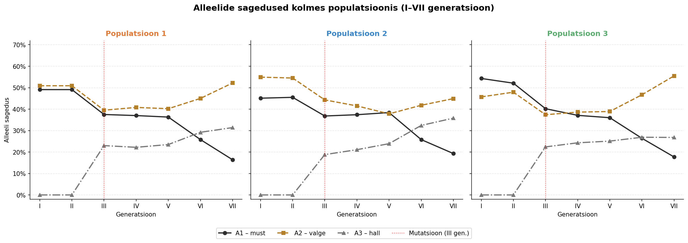
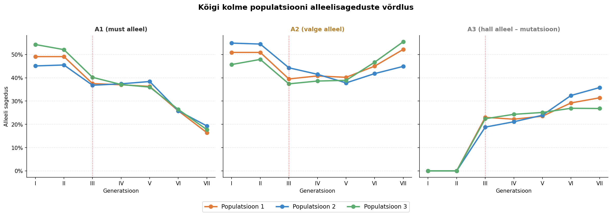
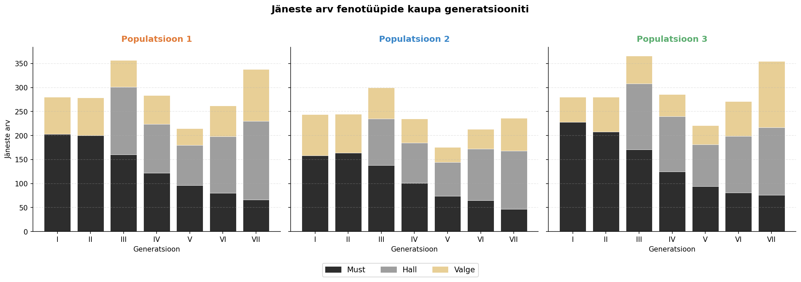
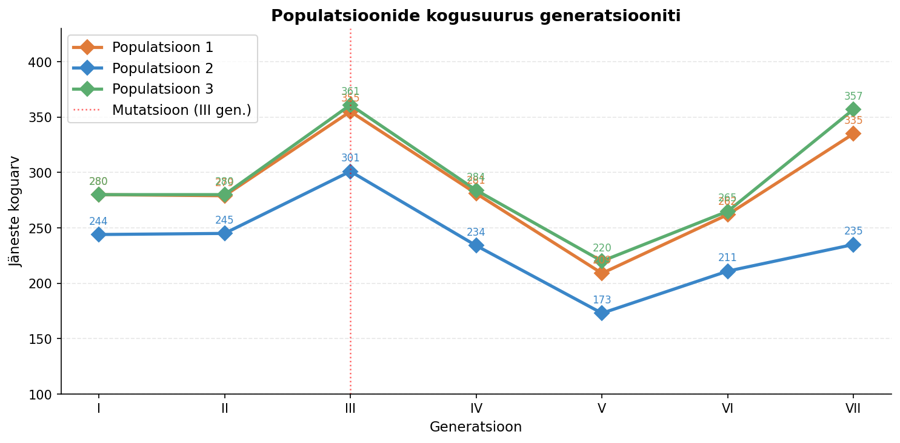

# Evolutsiooni simulatsioon – lauamängu tulemuste analüüs

Selles analüüsis uuritakse jäneste populatsiooni evolutsiooni simuleerivat lauamängu. Mängu käigus jälgiti **kolme populatsiooni** seitsme generatsiooni vältel. Iga jänes koosneb **kahest alleelist**:

| Alleel | Tähis | Tähendus |
|--------|-------|----------|
| Must alleel | A1 | Määrab jänese karvavärvi (must) |
| Valge alleel | A2 | Määrab jänese karvavärvi (valge) |
| Hall alleel | A3 | Ilmus mutatsiooni teel alates 3. generatsioonist |

Jäneste fenotüüp sõltub alleelide kombinatsioonist:
- **Kaks musta alleeli** → must jänes
- **Kaks valget alleeli** → valge jänes
- **Must + valge** → hall jänes (osaline dominantsus / kodominantsus)
- **Hall alleel (A3)** osaleb samuti halli värvuse tekitamises

## Prompt
XLSX failis on evolutsiooni simulatsiooni lauamängu tulemused. Mängus kasutati jäneseid, mis koosnevad kahest alleelist. Mängiti 7 generatsiooni. Esimesel generatsioonil oli laual jänesed, mis koosnesid kahest valgest, kahest mustast või ühest mustast ja ühest valgest. A1 on mustade alleelide osakaal, A2 on valgete alleelide osakaal, A3 on hallide alleelide osakaal. Lõpus on kirjas mitu musta, valget või halli on ühes generatsioonis. 3. generatsioonis ilmusid hallid alleelid. Iga järgneva generatsiooniga muudeti mingil viisil alleelide osakaalu. Nii kaua kuni jõuti 7. generatsioonini. Nii tehti kolmes mängus, populatsioon 1, populatsioon 2 ning populatsioon 3. Analüüsi lauamängude tulemusi ning selgita mõisteid selle lauamängu tulemuste põhjal. Joonista graafikuid, mis võrdlevad kolme populatsiooni. Kasuta graafikutel värve ka.

Kirjuta analüüs .ipynb faili ning tekst markdown formaadis.

mõisted: GEENIVOOL, MUTATSIOONILINE MUUTLIKKUS, KOMBINATIIVNE MUUTLIKKUS, GEENITRIIV, LOODUSLIK VALIK

## Andmed

### Populatsioon 1

| Generatsioon | A1 (must) | A2 (valge) | A3 (hall) | Must | Valge | Hall | Kokku |
|---|---|---|---|---|---|---|---|
| I | 49,1 % | 50,9 % | 0 % | 203 | 77 | 0 | 280 |
| II | 49,1 % | 50,9 % | 0 % | 200 | 79 | 0 | 279 |
| III | 37,5 % | 39,5 % | 23,0 % | 160 | 56 | 141 | 355 |
| IV | 37,0 % | 40,8 % | 22,2 % | 122 | 60 | 102 | 281 |
| V | 36,3 % | 40,2 % | 23,5 % | 96 | 35 | 84 | 209 |
| VI | 25,8 % | 45,0 % | 29,2 % | 80 | 64 | 118 | 262 |
| VII | 16,4 % | 52,2 % | 31,4 % | 66 | 108 | 164 | 335 |

### Populatsioon 2

| Generatsioon | A1 (must) | A2 (valge) | A3 (hall) | Must | Valge | Hall | Kokku |
|---|---|---|---|---|---|---|---|
| I | 45,1 % | 54,9 % | 0 % | 158 | 86 | 0 | 244 |
| II | 45,5 % | 54,5 % | 0 % | 164 | 81 | 0 | 245 |
| III | 36,8 % | 44,3 % | 18,8 % | 138 | 65 | 97 | 301 |
| IV | 37,4 % | 41,5 % | 21,1 % | 101 | 50 | 84 | 234 |
| V | 38,4 % | 37,8 % | 23,9 % | 74 | 32 | 70 | 173 |
| VI | 25,8 % | 41,8 % | 32,4 % | 65 | 41 | 107 | 211 |
| VII | 19,3 % | 44,9 % | 35,8 % | 47 | 68 | 121 | 235 |

### Populatsioon 3

| Generatsioon | A1 (must) | A2 (valge) | A3 (hall) | Must | Valge | Hall | Kokku |
|---|---|---|---|---|---|---|---|
| I | 54,3 % | 45,7 % | 0 % | 228 | 52 | 0 | 280 |
| II | 52,1 % | 47,9 % | 0 % | 208 | 72 | 0 | 280 |
| III | 40,2 % | 37,4 % | 22,4 % | 171 | 58 | 137 | 361 |
| IV | 37,1 % | 38,6 % | 24,3 % | 125 | 46 | 115 | 284 |
| V | 36,0 % | 38,9 % | 25,1 % | 94 | 40 | 87 | 220 |
| VI | 26,4 % | 46,7 % | 26,9 % | 81 | 72 | 118 | 265 |
| VII | 17,7 % | 55,5 % | 26,8 % | 76 | 138 | 141 | 357 |

## 1. Alleelide sageduste muutus generatsioonide vältel

Järgnev joonis näitab, kuidas iga alleeli (A1 – must, A2 – valge, A3 – hall) osakaal muutus seitsme generatsiooni jooksul kõigis kolmes populatsioonis.

## 2. Kolme populatsiooni alleelisageduste võrdlus

Järgnev graafik asetab kõik kolm populatsiooni samale teljestikule, et näha erinevusi ja sarnasusi alleelide sageduste muutuses.

## 3. Jäneste arv fenotüüpide kaupa (virntulpdiagramm)

Virntulpdiagramm kujutab iga generatsiooni jäneste absoluutarvude jaotust fenotüüpide (must, hall, valge) kaupa kolmes populatsioonis.

## 4. Populatsioonide suurus generatsiooniti

Populatsiooni suurus on oluline geenitriivi ulatuse mõistmiseks – mida väiksem on populatsioon, seda tugevam on juhuslike kõikumiste mõju.

## 5. Evolutsiooniliste mõistete selgitus lauamängu tulemuste põhjal

### 🔬 Mutatsiooniline muutlikkus

**Mutatsiooniline muutlikkus** on pärilike muutuste teke geenides ehk DNA järjestuses, mille tulemusel tekib uus alleel, mida populatsioonis varem polnud.

**Lauamängus:** Esimese kahe generatsiooni jooksul (I ja II) esines ainult kaks alleeli – **A1 (must)** ja **A2 (valge)**. Alates **III generatsioonist** ilmus mängu uus hallide alleelide grupp **A3**, mis sümboliseerib just mutatsioonilist muutlikkust. Mutatsioon andis populatsioonile uue geneetilise variandi, millest edaspidi sai loodusliku valiku ja muude jõudude "tooraine".

| Populatsioon | A3 sagedus III gen. | A3 sagedus VII gen. |
|---|---|---|
| Populatsioon 1 | 23,0 % | **31,4 %** |
| Populatsioon 2 | 18,8 % | **35,8 %** |
| Populatsioon 3 | 22,4 % | **26,8 %** |

Kõigis kolmes populatsioonis kasvas A3 osakaal pärast mutatsiooni ilmumist pidevalt – uus alleel levis populatsioonis edasi.

### 🔀 Kombinatiivne muutlikkus

**Kombinatiivne muutlikkus** tekib sugulise paljunemise käigus, kui vanemalt pärit alleelidest moodustuvad uued kombinatsioonid järglastel. See ei loo uusi alleele, kuid loob lõputult uusi genotüüpikombinatsioone.

**Lauamängus:** Kui hallid alleelid (A3) lisandusid III generatsioonis, muutus võimalike genotüübikombinatsioonide arv hüppeliselt. Nüüd sai tekkida kombinatsioone: A1A1, A1A2, A1A3, A2A2, A2A3, A3A3 – see on kombinatiivne muutlikkus töös. Mängu käigus "paariti" jäneseid, mille tulemusel tekkisid uued alleelide kombinatsioonid. Just see selgitab, miks kõigi kolme populatsiooni struktuuri muutused ei kulge identsel kujul – iga paardumisprotsess on kombinatoorselt unikaalne.

### 🌊 Geenivool

**Geenivool** on alleelide liikumine ühest populatsioonist teise, kui isendid rändavad ja paljunevad uues populatsioonis. See ühtlustab eri populatsioonide vahelist geneetilist erinevust.

**Lauamängus:** Kolme populatsiooni alleelisagedused on alguses erinevad, kuid näitavad sarnaseid trende – eriti A1 (must) vähenemisel ja A3 (hall) kasvamisel. See sarnane suund viitab, et kui need populatsioonid omavahel suhtleksid, looks geenivool veelgi suurema ühtlustamise. Reaalses elus takistaksid geenivoogu geograafilised barjäärid (mäed, jõed), inimtekkelised elupaikade killustatus jms.

### 🎲 Geenitriiv

**Geenitriiv** on alleelisageduse juhuslik muutus, mis on eriti tugev väikestes populatsioonides. See võib viia mingite alleelide kadumise või fikseerumiseni ka siis, kui neil pole selget kohastumuslikku eelist.

**Lauamängus:** Vaadates täpsemalt III–V generatsiooni, kus populatsioonil olid väiksemad arvud, on geenitriivi mõju kõige tõenäolisem.

**Väikseimad populatsioonid (potentsiaalne geenitriiv):**
- Pop2 – V generatsioon: **173 isendit** (väikseim kogu mängus)
- Pop1 – V generatsioon: **209 isendit**
- Pop3 – V generatsioon: **220 isendit**

Geenitriiv selgitab osaliselt, miks alleelisagedused kõiguvad mõnes generatsioonis ebamõistlikult palju – näiteks Pop1-s langeb A1 sagedus VI generatsiooniks järsult 36,3%-lt 25,8%-ni (langus ~10,5%).

### 🌿 Looduslik valik

**Looduslik valik** on protsess, mille käigus ellujäämisel ja paljunemisel eelisseisundis olevate isendite tunnused (ja neid kodeerivad alleelid) kanduvad edasi sagedamini. Kohastumus on tunnuste sobivus keskkonnatingimustega.

**Lauamängus:** Loodusliku valiku mõju on nähtav **must alleeli (A1) järjepideva vähenemisena** kõigis kolmes populatsioonis:

| Generatsioon | Pop1 A1 | Pop2 A1 | Pop3 A1 |
|---|---|---|---|
| I | 49,1 % | 45,1 % | 54,3 % |
| IV | 37,0 % | 37,4 % | 37,1 % |
| VII | **16,4 %** | **19,3 %** | **17,7 %** |

Kõigis kolmes populatsioonis väheneb must alleel (A1) selgelt ja järjepidevalt I–VII generatsioonini. See viitab, et **mustad jänesed olid ebasoodsas olukorras** – näiteks kiskjad leidsid nad kergemini üles (kui taust oli hele). Samal ajal **kasvas hall alleel (A3)** ning **valge alleel (A2) püsis stabiilsemana** – viimane isegi kasvas VII generatsiooniks oluliselt (Pop1: 50,9% → 52,2%; Pop3: 45,7% → 55,5%). See on klassikaline loodusliku valiku näide: ebasoodne fenotüüp (must) elimineeritakse, soodsam (hall/valge) saab eelise.

## 6. Kokkuvõte

Lauamängu tulemused peegeldavad viit olulist evolutsioonijõudu:

| Mõiste | Ilming mängus |
|---|---|
| **Mutatsiooniline muutlikkus** | Hall alleel A3 ilmus III generatsioonis |
| **Kombinatiivne muutlikkus** | Uued genotüübikombinatsioonid A3 lisandumisega |
| **Geenivool** | Kolme populatsiooni sarnased trendid (kui oleks vahetust) |
| **Geenitriiv** | Kõikumised väiksemates populatsioonides (eriti V gen.) |
| **Looduslik valik** | A1 (must) järjepidev vähenemine kõigis populatsioonides |

Kõige selgemalt ilmneb **looduslik valik** (must alleeli süstemaatiline kadu) ja **mutatsiooniline muutlikkus** (hall alleeli äkiline ilmumine III generatsioonis). **Geenitriiv** on kõige tugevam väikseima populatsiooni (Pop2, V gen.) juures. Kuna populatsioonid on eraldiseisvad, ei esine reaalset geenivoogu – kuid sarnased trendid näitavad, et kui geenivool võimaldatud oleks, liiguks ta populatsioonide ühtlustamise suunas.
